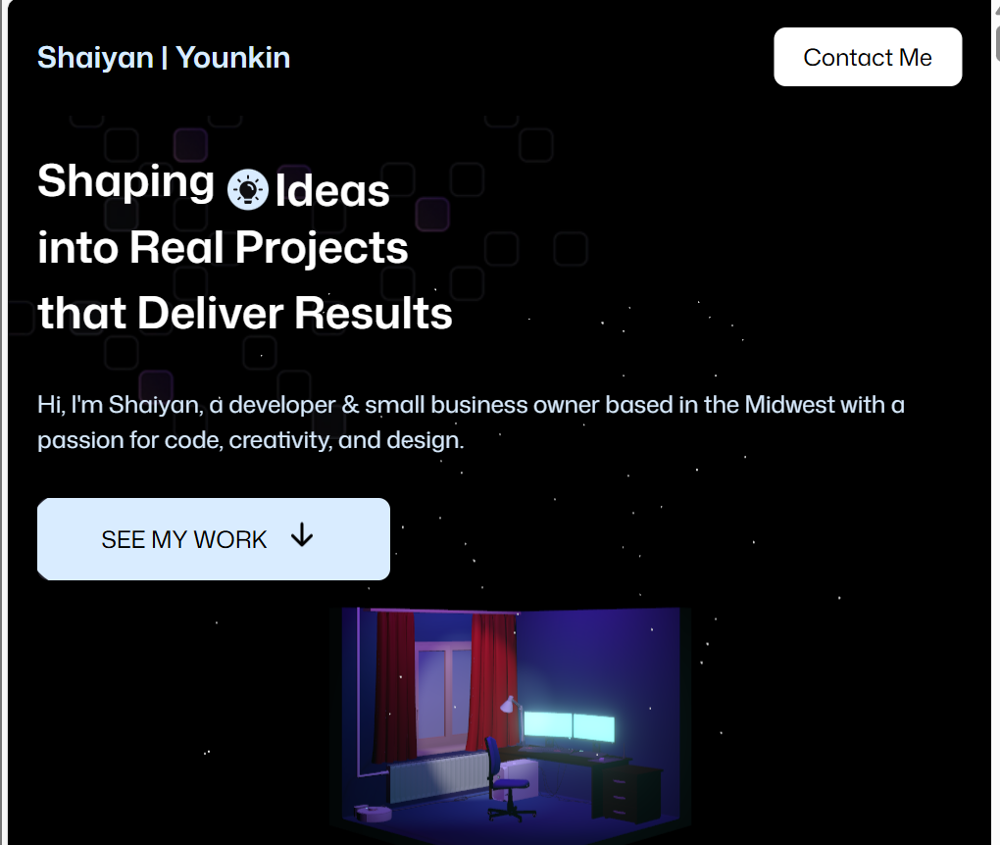
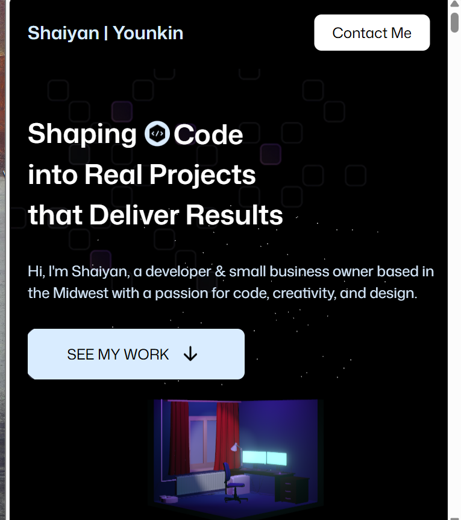
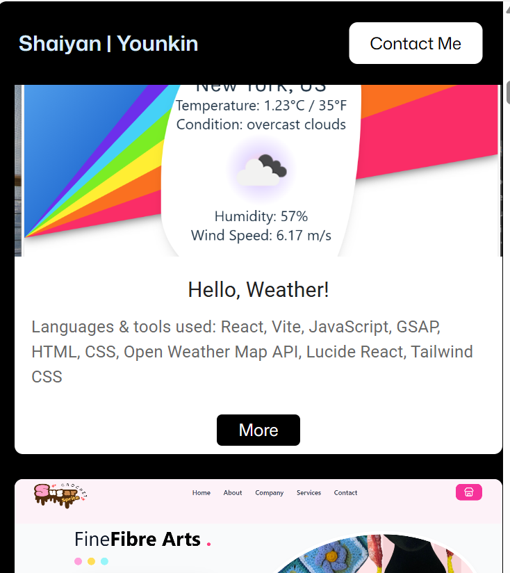

# My Portfolio

_Desktop View_

**Welcome to my 2026 web development portfolio**, where I'm excited to share some of my favorite projects I've built so far.

## Languages & Tools used

I started building my portfolio with ReactJS & Vite as the scaffolding (and, of course, HTML, CSS, and JavaScript as essential building blocks), ThreeJS for the 3D models, GSAP for the smooth animations, and TailwindCSS for responsiveness and to ensure that the site looks great on the user's end whether they view the page on desktop, mobile, or tablet.

## Challenges

I had to do some serious brainstorming when it came to deciding on the layout I wanted for my Projects section, and I faced some difficulties with importing te 3D models. I also had to battle with the EmailJS add-on due to conflicting dependencies in the package.json, but a little Googling, uninstalling, and re-installing took care of that. The true challenge appeared once I deployed the project to Netlify for live hosting.

## The Solution

Thanks to Google, Netlify debugging tips, and my sheer determination, my portfolio was up and running, live and online at long last! I've had issues deploying **specifically ReactJS** projects to Netlify before, but this project taught me that the process generally goes smoother when I deploy my websites through the terminal using NPM commands and sync it to the repository instead of manually deploying the static folder on the Netlify website.

_Tablet View_

_Mobile View_
